# Siamese Trade Matching — Visual Documentation

> **Audience**: Technical managers and engineers evaluating the matching pipeline.  
> **Repo**: `src/model/nn_matching/`  
> **Notebook**: `notebooks/siamese_txn_matching.ipynb`

---

## 1 · Pipeline Overview

How raw trades flow through the system from ingestion to ranked results.

```mermaid
flowchart LR
    subgraph DATA ["1 · Data Ingestion"]
        A1[Raw Trades<br/><i>parquet / CSV</i>]
        A2[Filter & Clean<br/><i>valid Match IDs,<br/>allowed rules</i>]
        A3[1-to-1 Pairs<br/><i>group size = 2</i>]
        A1 --> A2 --> A3
    end

    subgraph PREP ["2 · Feature Engineering"]
        B1[Normalize Text<br/><i>combined_text</i>]
        B2[Date → int cols]
        B3[Train / Val / Test<br/><i>stratified group split</i>]
        A3 --> B1 --> B2 --> B3
    end

    subgraph CAND ["3 · Candidate Generation"]
        C1[Block by Currency]
        C2[Date Window<br/><i>±20 days</i>]
        C3[Amount Tolerance<br/><i>±30 %</i>]
        C4[Rank & Top-K]
        B3 --> C1 --> C2 --> C3 --> C4
    end

    subgraph EPISODES ["4 · Episode Construction"]
        D1[Clone positive →<br/>synthetic query]
        D2[Rebuild query<br/>combined_text]
        D3[Attach K negatives<br/><i>from candidate pool</i>]
        C4 --> D1 --> D2 --> D3
    end

    subgraph MODEL ["5 · Siamese Ranking"]
        E1[TF-IDF char n-grams<br/><i>fit on train only</i>]
        E2[Shared Encoder<br/><i>text_fc + scalar_fc</i>]
        E3[Comparison Head<br/><i>|u−v|, u⊙v, pair feats</i>]
        E4[Listwise CE Loss<br/><i>softmax over K cands</i>]
        D3 --> E1 --> E2 --> E3 --> E4
    end

    subgraph EVAL ["6 · Evaluation"]
        F1[P@1 / MRR]
        F2[Score Distribution]
        F3[Early Stopping<br/><i>patience = 3</i>]
        E4 --> F1
        E4 --> F2
        F1 --> F3
    end

    style DATA fill:#e8f4f8,stroke:#2196F3
    style PREP fill:#e8f8e8,stroke:#4CAF50
    style CAND fill:#fff8e1,stroke:#FF9800
    style EPISODES fill:#fce4ec,stroke:#E91E63
    style MODEL fill:#ede7f6,stroke:#673AB7
    style EVAL fill:#e0f2f1,stroke:#009688
```

**What it shows**: Six pipeline stages — from raw parquet files to final ranked matches — each with its key parameters. The pipeline is modular: each coloured block maps to a Python module under `pipeline/` or `models/`.

> 📂 Source: [`pipeline_overview.mmd`](pipeline_overview.mmd)

---

## 2 · Candidate Generation (Blocking + Top-K)

How the candidate pool is narrowed before the neural network ever sees a pair.

```mermaid
flowchart TD
    Q["🔍 Query Trade<br/><i>Currency: GBP<br/>Amount: 1,000,000<br/>Date: 2026-01-15</i>"]

    subgraph BLOCKING ["Stage 1 · Blocking Filters"]
        direction TB
        BF1["Currency Match<br/><i>same currency only</i>"]
        BF2["Date Window<br/><i>|date_q − date_c| ≤ 20 days</i>"]
        BF3["Amount Tolerance<br/><i>|amt_q − amt_c| / |amt_q| ≤ 30%</i>"]
        BF1 --> BF2 --> BF3
    end

    subgraph RANK ["Stage 2 · Ranking & Top-K"]
        direction TB
        R1["Sort by:<br/>1. ref_exact ↓<br/>2. amount_diff ↑<br/>3. date_diff ↑"]
        R2["De-duplicate<br/><i>by Trade Id</i>"]
        R3["Take Top-K<br/><i>K = 50</i>"]
        R1 --> R2 --> R3
    end

    subgraph OUTPUT ["Candidate List"]
        direction TB
        O1["✅ Candidate 1 — closest amount + date"]
        O2["　 Candidate 2"]
        O3["　 Candidate 3"]
        O4["　 ···"]
        OK["　 Candidate K"]
    end

    Q --> BLOCKING
    BLOCKING --> RANK
    RANK --> OUTPUT

    POOL["Full Trade Pool<br/><i>N trades</i>"] -.->|"~N candidates<br/>before blocking"| BF1
    BF3 -.->|"≪ N candidates<br/>after blocking"| R1

    style Q fill:#fff3e0,stroke:#E65100,stroke-width:2px
    style BLOCKING fill:#e3f2fd,stroke:#1565C0
    style RANK fill:#f3e5f5,stroke:#6A1B9A
    style OUTPUT fill:#e8f5e9,stroke:#2E7D32
    style POOL fill:#fafafa,stroke:#9E9E9E,stroke-dasharray: 5
```



**What it shows**: Blocking is a coarse funnel that reduces N×N comparisons to a manageable list. The heuristic sort guarantees the most plausible candidates appear first; the neural network then re-ranks them.

> 📂 Source: [`candidate_generation.mmd`](candidate_generation.mmd)

---

## 3 · Siamese Network Architecture

The shared encoder and comparison head that score each query–candidate pair.


**What it shows**: Query and candidate pass through the **same** encoder (weight sharing). The comparison head combines element-wise differences, products, and hand-crafted pair features before producing a single logit. Training uses listwise cross-entropy over all K candidates.

> 📂 Source: [`siamese_architecture.mmd`](siamese_architecture.mmd)

---

## 4 · Evaluation Metrics Flow

How raw logits become ranking metrics, threshold metrics, and business KPIs.

```mermaid
flowchart LR
    subgraph RAW ["Model Output"]
        L["Logits per episode<br/><i>shape: (K,) per query</i>"]
    end

    subgraph RANKING ["Ranking Metrics"]
        direction TB
        SORT["argsort(logits, desc)"]
        PAT1["P@1<br/><i>is rank of positive = 0?</i>"]
        RATK["Recall@K<br/><i>positive in top-K?</i>"]
        MRR["MRR<br/><i>1 / (rank + 1)</i>"]
        NDCG["nDCG<br/><i>discounted gain</i>"]
        SORT --> PAT1
        SORT --> RATK
        SORT --> MRR
        SORT --> NDCG
    end

    subgraph THRESHOLD ["Threshold Metrics<br/><i>choose score cut-off τ</i>"]
        direction TB
        SIG["σ(logit) → score ∈ [0,1]"]
        CM["Confusion Matrix<br/><i>TP / FP / FN / TN</i>"]
        PR["Precision · Recall · F1"]
        AUC["PR-AUC · ROC-AUC"]
        SIG --> CM --> PR
        SIG --> AUC
    end

    subgraph BIZ ["Business / Operational"]
        direction TB
        COV["Coverage<br/><i>% queries with ≥1 candidate</i>"]
        WL["Review Workload<br/><i>avg candidates / query</i>"]
        TTM["Time-to-Match<br/><i>latency per query</i>"]
    end

    L --> SORT
    L --> SIG
    L --> COV
    L --> WL
    L --> TTM

    style RAW fill:#e8eaf6,stroke:#283593
    style RANKING fill:#e8f5e9,stroke:#1B5E20
    style THRESHOLD fill:#fff3e0,stroke:#E65100
    style BIZ fill:#fce4ec,stroke:#880E4F
```



> 📂 Source: [`eval_metrics.mmd`](eval_metrics.mmd)

---

## 5 · Evaluation Plots

The script [`scripts/plot_eval.py`](../../scripts/plot_eval.py) generates two standard evaluation visuals from training results:

```bash
python scripts/plot_eval.py --metrics metrics/eval_results.json
```

### Recall@K Curve

Shows how recall improves as the number of candidates considered per query (K) increases. This is a standard diagnostic for ranking systems: a steep early rise means the model pushes the correct match near the top of the list.

### Score Distribution

Plots the model's output scores for positive (true match) and negative (non-match) pairs. Greater separation between the two distributions indicates the model has learned a discriminative signal, making threshold selection easier in a production setting.

---

## 6 · Generalisation to Other Business Matching Problems

The architecture is domain-agnostic. The same pipeline applies whenever you need to match records from two pools:

| Business Problem | "Query" | "Candidate Pool" | Blocking Keys | Text Features |
|---|---|---|---|---|
| **Intercompany trade matching** *(this project)* | Trade from System A | Trades in System B | Currency, date, amount | ISIN, CUSIP, instrument name |
| **Entity resolution** | Company mention | Master company list | Country, industry | Company name, address |
| **Invoice reconciliation** | Purchase order | Incoming invoices | Vendor, amount ±5 % | Line-item descriptions |
| **Claims / document matching** | Insurance claim | Policy documents | Policy number prefix | Claim narrative, policy text |
| **Securities reference data** | New listing record | Existing securities DB | Exchange, asset class | Ticker, name, ISIN |

**Adaptation checklist:**
1. Swap the data loader and column config.
2. Update blocking rules to domain-appropriate keys.
3. Choose text columns for `combined_text`.
4. Retrain — the architecture stays the same.

---

## 7 · Evaluation Metrics — Theory

This section describes the families of metrics applicable to ranking-based matching pipelines. The pipeline currently computes **P@1** and **MRR**; the remaining metrics are documented here as reference for future extensions.

### 7.1 Ranking Metrics

Ranking metrics evaluate how well the model orders candidates, without requiring a fixed score threshold.

| Metric | Definition | Typical Use |
|--------|-----------|-------------|
| **P@1** *(Precision at 1)* | Is the top-ranked candidate the true match? | Systems that auto-match the top result without human review. |
| **Recall@K** | Is the true match anywhere in the top-K candidates? | Workflows where a reviewer sees K suggestions and picks the correct one. |
| **MRR** *(Mean Reciprocal Rank)* | Average of 1/(rank of true match). | Captures ranking quality beyond top-1; penalises models that push the correct match down the list. |
| **nDCG** *(Normalised Discounted Cumulative Gain)* | Log-discounted relevance gain. | Designed for graded relevance levels (e.g. exact match vs partial match). Less informative when relevance is binary (match / non-match). |

### 7.2 Threshold Metrics

When a score cut-off is introduced to route pairs to auto-match vs manual review, threshold-based metrics become relevant.

| Metric | Notes |
|--------|-------|
| **PR-AUC** *(Precision-Recall AUC)* | Summarises the precision-recall trade-off across all thresholds. Preferred when negatives outnumber positives. |
| **ROC-AUC** | Can appear misleadingly high under class imbalance; interpret with caution. |
| **F1 / Fβ** | F1 weights precision and recall equally. Fβ lets you bias towards recall (β > 1) or precision (β < 1) depending on operational priorities. |
| **Precision & Recall at τ** | The raw numbers at a chosen operating point. |

> **Note:** The current model outputs raw logits consumed by a softmax over the candidate set (listwise CE). Threshold-based metrics would require applying a sigmoid to individual logits to obtain per-pair scores in [0, 1].

### 7.3 Operational Metrics

These measure the pipeline's behaviour in a production context rather than the model's scoring quality.

| Metric | Description |
|--------|-------------|
| **Coverage** | % of queries for which blocking produces at least one candidate. Low coverage creates a recall ceiling before the model runs. |
| **Avg candidates / query** | Drives review workload and compute cost. |
| **% sent to manual review** | At a given threshold, how many pairs require human inspection. |
| **Latency / throughput** | End-to-end time per query and trades processed per second. |

### 7.4 Data Quality & Robustness

| Check | Description |
|-------|-------------|
| **Segment-level metrics** | Breaking results by currency, product type, or match rule can reveal segments where performance differs significantly from the aggregate. |
| **Drift monitoring** | Tracking core metrics over time detects distribution shift and signals when retraining may be needed. |
| **Calibration** | If scores are surfaced to users as confidence values, reliability curves and Expected Calibration Error (ECE) measure how well scores reflect true probabilities. |

---

## File Index

| File | Type | Description |
|------|------|-------------|
| [`pipeline_overview.mmd`](pipeline_overview.mmd) | Mermaid | End-to-end pipeline (6 stages) |
| [`candidate_generation.mmd`](candidate_generation.mmd) | Mermaid | Blocking funnel + top-K detail |
| [`siamese_architecture.mmd`](siamese_architecture.mmd) | Mermaid | Network architecture (encoder + head) |
| [`eval_metrics.mmd`](eval_metrics.mmd) | Mermaid | Metric computation flow |
| [`../../scripts/plot_eval.py`](../../scripts/plot_eval.py) | Python | Script that generates evaluation PNGs from training results |
